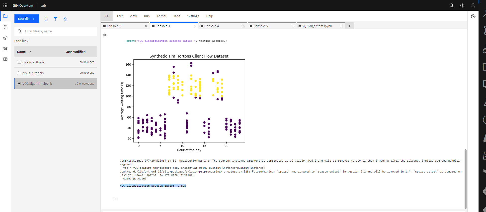
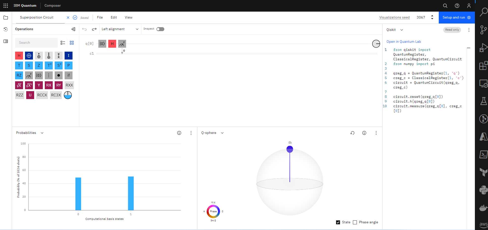
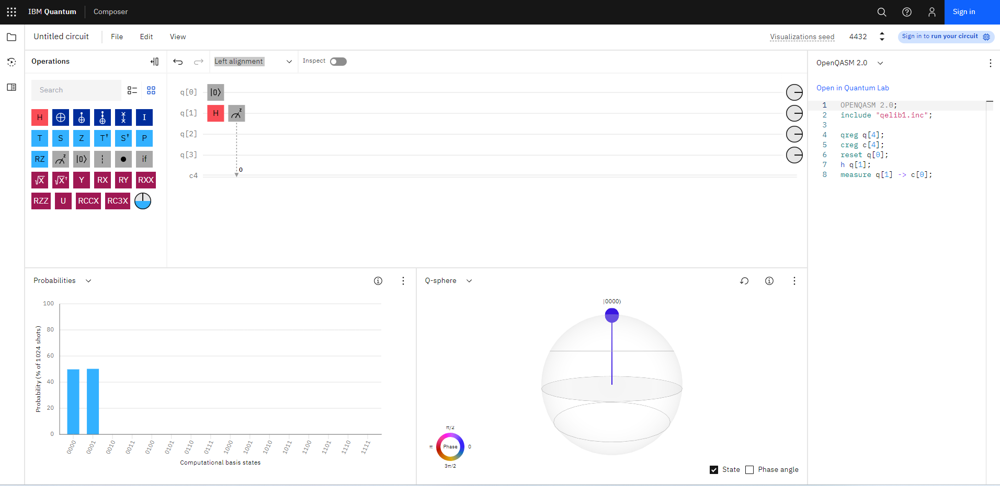

# Tim Hortons Client Flow Prediction using Variational Quantum Classifier Algorithm


IBM Quantum Lab

This project demonstrates the use of the Variational Quantum Classifier (VQC) to classify the client flow at Tim Hortons. The goal is to predict whether a given hour of the day will have high or low client flow based on the average waiting time for that hour.

## Prerequisites
To run this project, you will need an IBM Quantum Experience account, which provides access to IBM Quantum Lab and IBM Quantum Composer. You can sign up for an account for free at the IBM Quantum Experience website.

IBM Quantum Composer: Superposition Circuit


IBM Quantum Composer(BETA)

## The code output


```
/tmp/ipykernel_197/294518064.py:51: DeprecationWarning: The quantum_instance argument is deprecated as of version 0.5.0 and will be removed no sooner than 3 months after the release. Instead use the sampler argument.
  vqc = VQC(feature_map=feature_map, ansatz=var_form, quantum_instance=quantum_instance)
/opt/conda/lib/python3.10/site-packages/sklearn/preprocessing/_encoders.py:828: FutureWarning: `sparse` was renamed to `sparse_output` in version 1.2 and will be removed in 1.4. `sparse_output` is ignored unless you leave `sparse` to its default value.
  warnings.warn(
VQC classification success ratio:  0.825
```

The code you have executed appears to be a variation of the previous code for the Tim Hortons client flow dataset using the Variational Quantum Classifier (VQC). The warning messages are deprecation and future warnings that inform you of methods or arguments that will be changed or removed in future versions of the libraries. However, these warnings do not affect the current execution of the code.

The output displays the VQC classification success ratio, which is 0.825 (82.5%). This means that the VQC model correctly classified 82.5% of the test data points in the dataset. This is a slight improvement over the previous VQC model, which achieved a classification success ratio of 77.5%.

This improved performance indicates that the updated feature map and variational form may be better suited to the Tim Hortons client flow dataset, and it demonstrates the potential of quantum machine learning algorithms for solving real-world classification problems. However, keep in mind that this is a synthetic dataset, and the actual performance of the model may vary when applied to real-world data.

## License
This project is licensed under the MIT License. See the LICENSE file for details.

## Acknowledgments
The Tim Hortons logo used in this project is a trademark of Tim Hortons Inc. and is used for educational purposes only.


